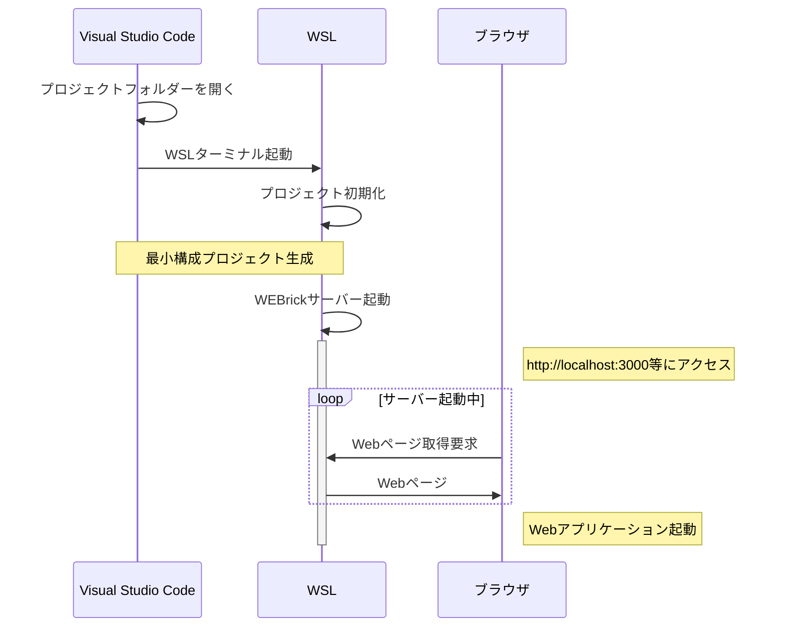

[[_TOC_]]

# Ruby on Railsの環境構築

Ruby on Railsの環境構築手順について記載します。

WSL(Debian)にRuby on Railsの開発環境を構築します。エディターはVisual Studio Codeを使用します。

Railsアプリケーションの実行イメージは次のようになります。



## Ruby on Railsとは

Ruby on Railsは、Webアプリケーション開発フレームワークです。

Ruby on Railsを用いてWebアプリケーション開発を行う場合、開発言語は主にRubyとなります。画面のレイアウト関連はHTMLやCSSです。HTMLと言いましたが、実際は`.html.erb`というファイル(Ruby言語を使用できるHTMLを記載するファイル)を作成することになります。

## 開発環境構築手順

WSL(Debian)にインストールしていきます。

ワークディレクトリはホームディレクトリを前提としています。

### インストール手順

最新のコマンドをインストールするためにGITを利用します。

また、関連パッケージをインストールします。


```bash
$ sudo apt install git -y
$ sudo apt install git-core curl zlib1g-dev build-essential libssl-dev libreadline-dev libyaml-dev libsqlite3-dev sqlite3 libpq-dev libxml2-dev libxslt1-dev libcurl4-openssl-dev software-properties-common libffi-dev
```

Rubyのバージョン管理ソフト「rbenv」をインストールする。

```bash
$ git clone https://github.com/rbenv/rbenv.git ~/.rbenv
```

初期化コマンドを記載する。

```bash
$ echo 'export PATH="$HOME/.rbenv/bin:$PATH"' >> ~/.bashrc
$ echo 'eval "$(rbenv init -)"' >> ~/.bashrc
$ exec $SHELL
```

ruby-buildをインストールする。

```bash
$ git clone https://github.com/rbenv/ruby-build.git ~/.rbenv/plugins/ruby-build
$ echo 'export PATH="$HOME/.rbenv/plugins/ruby-build/bin:$PATH"' >> ~/.bashrc
$ exec $SHELL
```

rbenvでインストール可能なRubyバージョンのリストを確認する。

```bash
$ rbenv install -l
```

今回は現在（2018/04/15）時点で最新のRubyをインストールする。

```bash
$ rbenv install 2.5.1
```

システムで使用しているrubyのバージョンを確認する。

```bash
$ rbenv global
```

「system」と表示される場合は、rbenvでインストールしたRubyではなく、標準のRubyが利用される状態となります。そのため、インストールしたRubyを使用するように変更します。

```bash
# 2.5.1のバージョンを使用するように設定
$ rbenv global 2.5.1

# 設定バージョン確認（設定したバージョンが表示される）
$ rbenv global

# 設定更新（反映）
$ rbenv rehash
```

gemをインストールした後の`rbenv rehash`を自動化する。

```bash
$ gem i rbenv-rehash
```

Ruby On Railsをインストールするため、依存関係のNode.jsをインストールする。

下記コマンドで、`/setup_9.x`はバージョンになるため、`https://deb.nodesource.com`にアクセスして存在するバージョンを指定する。

```bash
$ curl -sL https://deb.nodesource.com/setup_9.x | sudo -E bash -
$ sudo apt-get install -y nodejs
```

gemが自動で作成するri rdocドキュメントを無効化する。

```bash
$ echo 'install: --no-rdoc --no-ri' >> ~/.gemrc
$ echo 'update:  --no-rdoc --no-ri' >> ~/.gemrc
```

Railsをインストールする（バージョンを指定しない場合は最新版がインストールされる）。

```bash
$ gem install rails
```

### rbenvのアップグレード

```bash
$ cd ~/.rbenv
$ git pull
```

### アンインストール手順（Ruby開発が不要になった場合に実施）

Rubyのアンインストール

```bash
$ rbenv uninstall バージョン
```

rubyもRailsを消したい場合、 gem, apt-getで入れたものを削除することに加え以下を実行する。

```bash
$ gem uninstall railties 'railsのバージョン'
$ rm -rf /usr/local/lib/ruby
$ rm -rf /usr/lib/ruby
$ rm -f /usr/local/bin/ruby
$ rm -f /usr/bin/ruby
$ rm -f /usr/local/bin/irb
$ rm -f /usr/bin/irb
$ rm -f /usr/local/bin/gem
$ rm -f /usr/bin/gem
```

