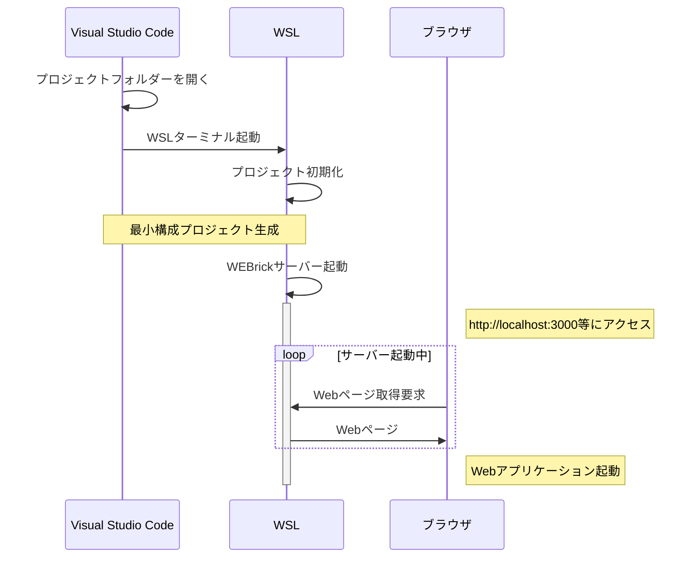

[[_TOC_]]

# Ruby on Railsの環境構築

Ruby on Railsの環境構築手順について記載します。

WSL(Debian)にRuby on Railsの開発環境を構築します。エディターはVisual Studio Codeを使用します。

イメージは次のようになります。

```mermaid
sequenceDiagram
    participant V as Visual Studio Code
    participant W as WSL
    participant B as ブラウザ

    V->>V: プロジェクトフォルダーを開く
    V->>W: WSLターミナル起動
    W->>W: プロジェクト初期化
    Note over V,W: 最小構成プロジェクト生成
    W->>W: WEBrickサーバー起動
    activate W
    Note right of B: http://localhost:3000等にアクセス
    loop サーバー起動中
        B->>W: Webページ取得要求
        W->>B: Webページ
    end
    Note right of B: Webアプリケーション起動
    deactivate W
```

## Ruby on Railsとは

## 開発環境構築手順